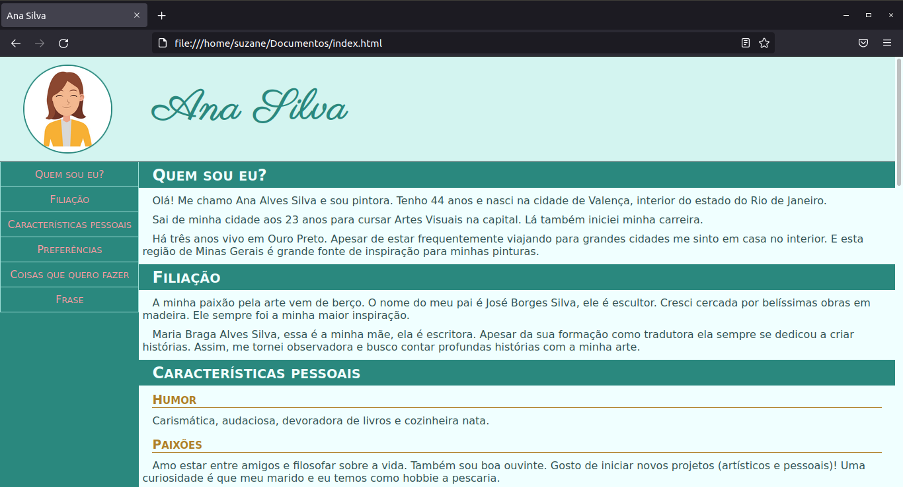

# Criando uma página pessoal :woman:

Este projeto apresenta uma página com o perfil pessoal de um personagem fictício utilizando HTML e CSS.

## :gear: Tecnologias

- HTML5
- CSS3

## :art: Layout

